<p align="center">
  
</p>

# Spendly

A minimal expense tracker for iPhone. Type the amount, tap a category, and it is saved.


<p align="center">
  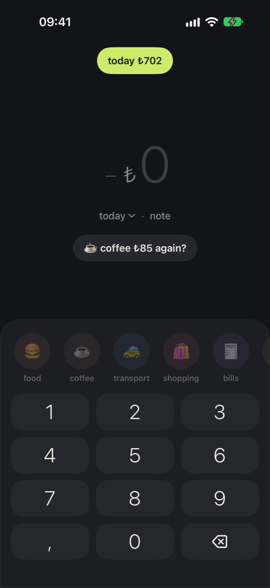
  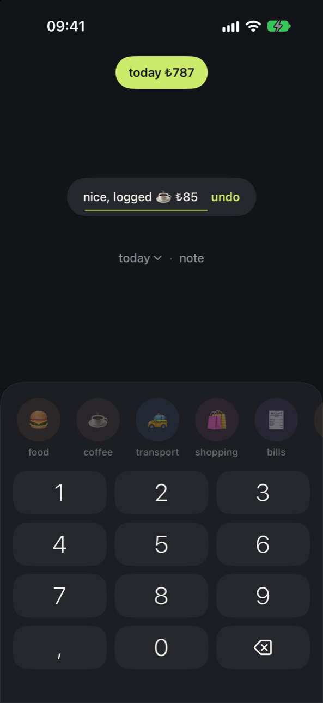
  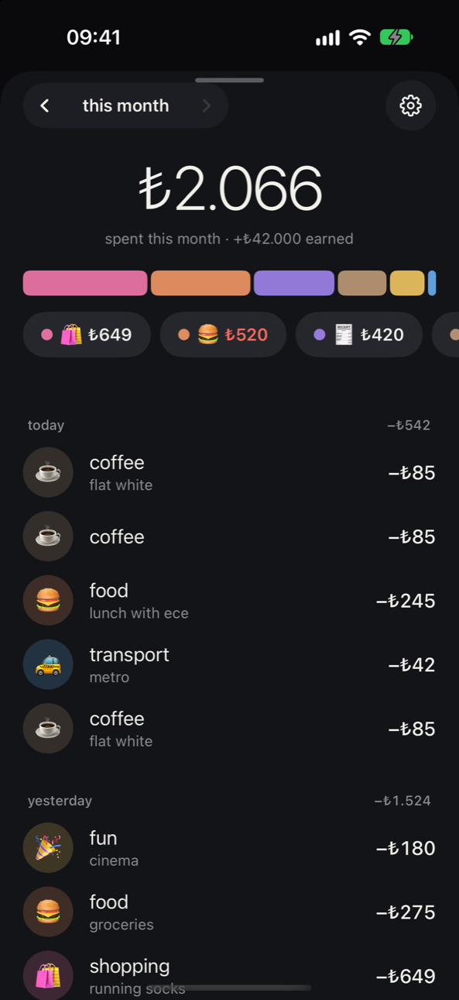
  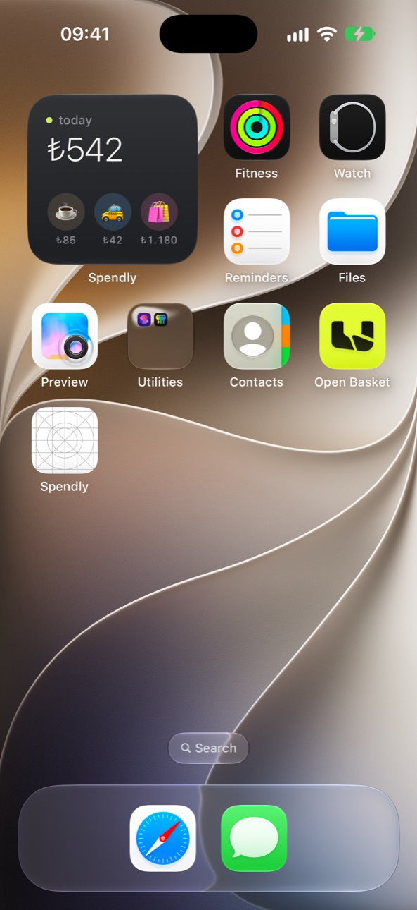
</p>

## About

Most budgeting apps try to do everything. Spendly focuses on one thing: logging an expense in a few seconds. The app opens on the keypad, works offline and needs no account. Expenses can also be logged from a home screen widget or with Siri, without opening the app.

## Features

- Two-tap logging with undo
- Suggestion to repeat your usual expense
- Income entries and past days
- Monthly overview by category
- Your own categories with a name, emoji and color
- Monthly budget per category, with a notification at 80% and 100%
- Daily and weekly reminders
- Home screen and lock screen widgets, Control Center button
- Siri and Shortcuts support
- English and Turkish

**Spendly Pro** (monthly or one-time purchase) removes the free limits of 3 custom categories and 1 budget, and adds CSV export.

## Screenshots

| Quick add | Amount typed | Saved | Income |
|:---:|:---:|:---:|:---:|
|  | 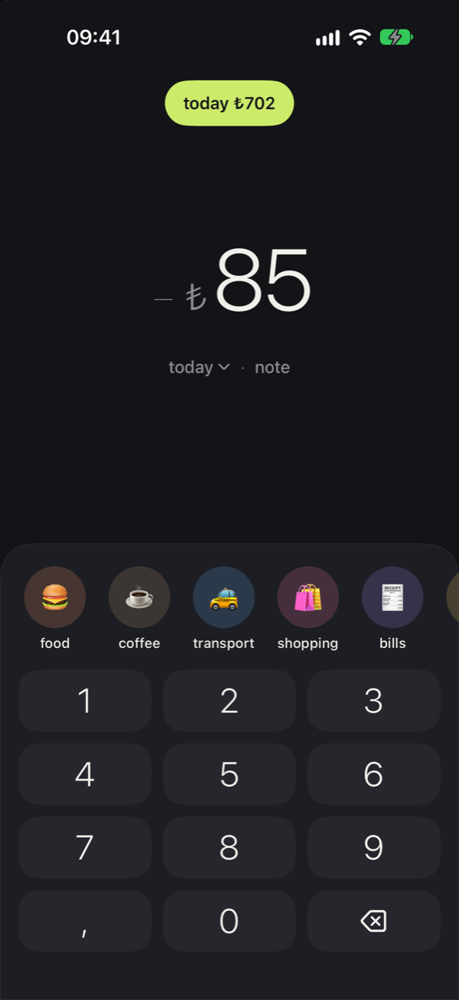 |  | 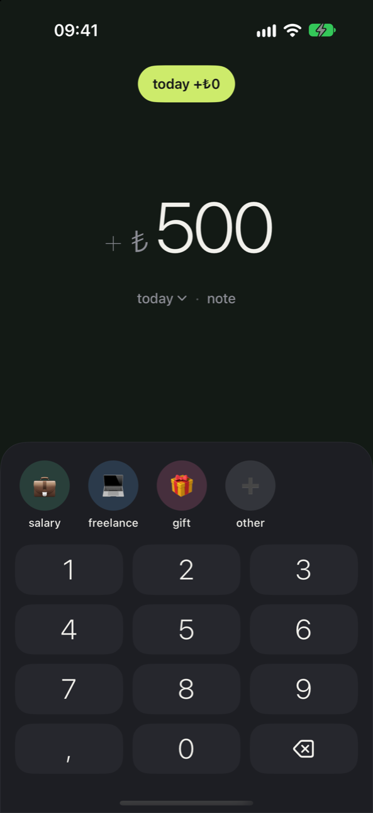 |

| Past day | Overview | Budget | Edit |
|:---:|:---:|:---:|:---:|
| 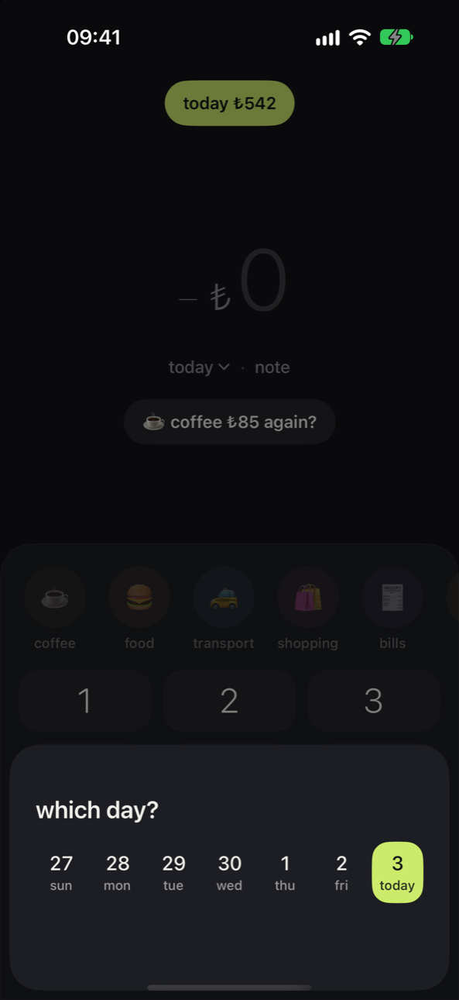 |  | 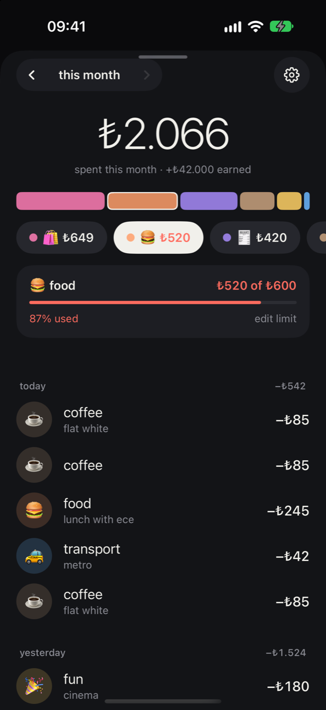 | 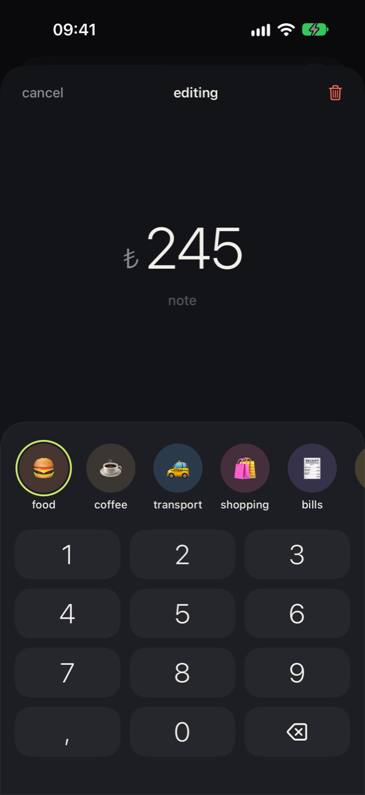 |

| Settings | Widget |
|:---:|:---:|
| 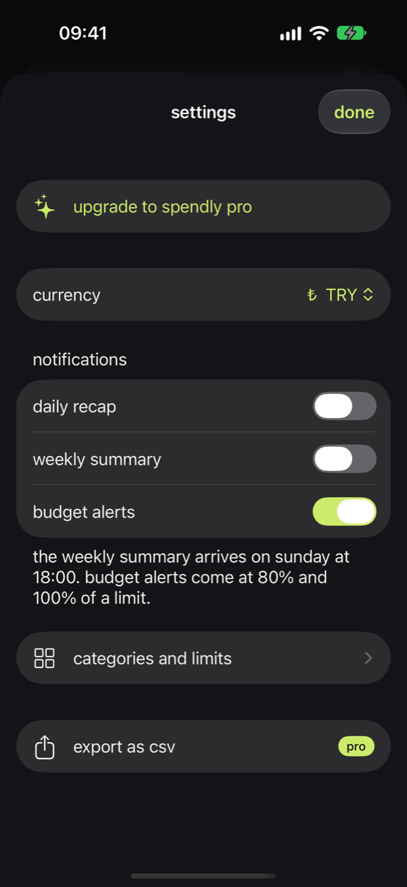 |  |

## Tech Stack

| Area | Technology |
|------|------------|
| Language | Swift 6 |
| UI | SwiftUI |
| Storage | SwiftData, shared through an App Group |
| Sync | CloudKit (ready, turned on with the iCloud capability) |
| Widgets | WidgetKit (home screen, lock screen, Control Center) |
| Siri and Shortcuts | App Intents |
| Notifications | UserNotifications (local reminders and budget alerts) |
| Purchases | StoreKit 2 |
| Localization | String Catalogs (English, Turkish) |
| Modules | Swift Package Manager |
| Tests | Swift Testing |

## Architecture

Spendly has no backend. The app, the widgets and Siri all read and write the same local store, and the shared logic lives in a Swift package.

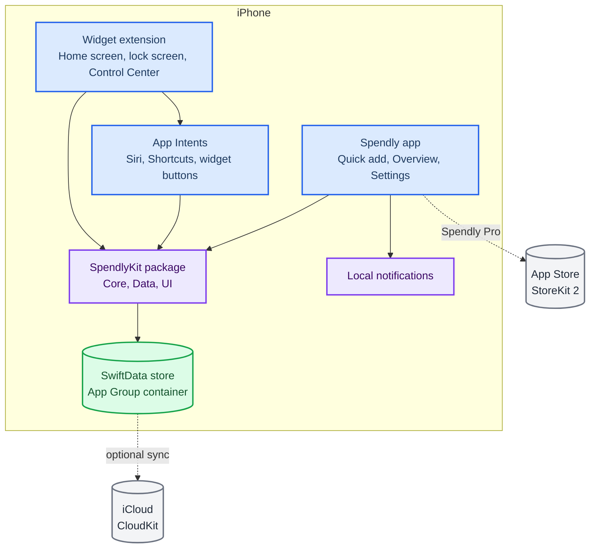

```
Spendly/              App: screens and reminders
SpendlyWidgets/       Widget extension
Shared/               App Intents and the shared store, used by the app and the widgets
Packages/SpendlyKit/  SpendlyCore (money, keypad), SpendlyData (storage), SpendlyUI (design system)
```

## Getting Started

Requires an iOS 18+ simulator or device. Built with Xcode 27.

```bash
open Spendly.xcodeproj
```

Run the `Spendly` scheme. To load sample data in a debug build, launch with the `-demo` argument:

```bash
xcrun simctl launch booted com.kaancankurt.spendly -demo
```

In-app purchases can be tried locally with the `Spendly.storekit` configuration, which the `Spendly` scheme uses when the app is run from Xcode.

Run the tests:

```bash
cd Packages/SpendlyKit && swift test
```

The earlier Flutter and Node.js version is on the [`archive/flutter`](https://github.com/KaanCan1/Spendly/tree/archive/flutter) branch.

## Author

**Kaan Can Kurt**, Flutter and Full Stack Developer

[Portfolio](https://kaancankurt.vercel.app) · [LinkedIn](https://linkedin.com/in/kaan-can-kurt-805990299) · [GitHub](https://github.com/KaanCan1)
